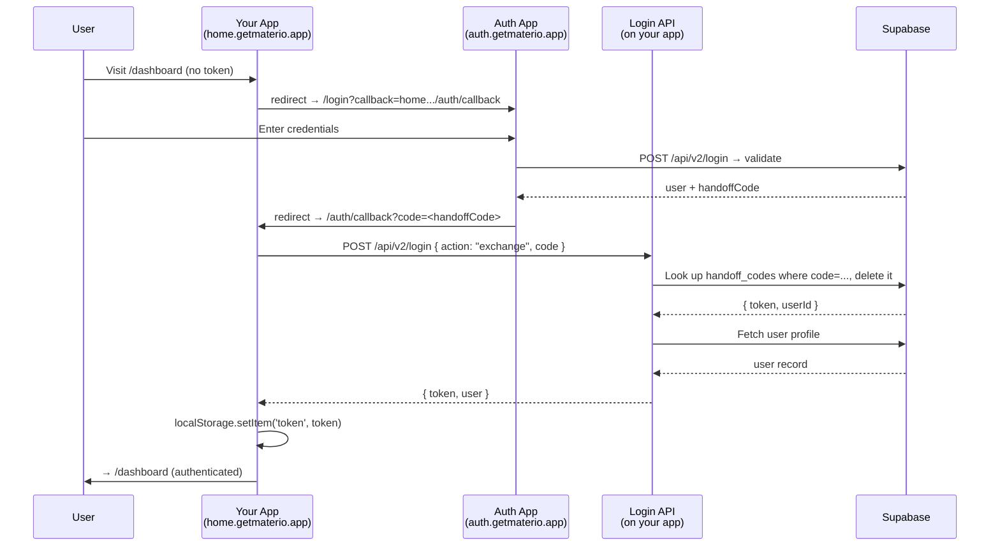

# Internal Integration Guide

> How Materio's own apps (`accounts`, `auth`, `admin`, and any future subdomain like `home.getmaterio.app`) authenticate users across domains using the handoff-callback system.

---

## Architecture Overview

Materio is a multi-app system where **auth.getmaterio.app** is the single sign-on (SSO) gateway. Users always log in through the auth app, and other apps receive a JWT via a short-lived **handoff code**.

```
┌─────────────────┐     ①  redirect to auth     ┌──────────────────┐
│  accounts.       │ ──────────────────────────► │  auth.            │
│  getmaterio.app  │                             │  getmaterio.app   │
│                  │     ④  redirect back with   │                   │
│  /auth/callback  │ ◄────────── handoff code    │  /login           │
│       ▼          │                             │   ▼               │
│  exchange code   │                             │  user logs in     │
│  for JWT + user  │                             │  POST /api/v2/    │
│  localStorage    │                             │  login            │
│  ✅ logged in     │                             │  → handoffCode    │
└─────────────────┘                             └──────────────────┘
```

**The flow in 4 steps:**

1. **App detects unauthenticated user** → redirects to `auth.getmaterio.app/login?callback=<this-app-callback-url>`
2. **Auth app** shows login UI (password, OTP, or 2FA) → calls `POST /api/v2/login` → receives a `handoffCode`
3. **Auth app redirects back** to the `callback` URL with `?code=<handoffCode>`
4. **Receiving app's callback page** calls `POST /api/v2/login` with `{ action: "exchange", code }` → receives a JWT and user object → stores token in `localStorage`

---

## Monorepo App vs. Separate Codebase

There are two scenarios when building a new Materio application:

| Feature | Monorepo App (Inside `account-app`) | Separate Codebase (External Repo / Next.js / React / etc.) |
|---|---|---|
| **Location** | `apps/<app-name>` in this monorepo | Separate Git repository |
| **Packages** | Can import `@materio/config`, `@materio/ui` | Uses environment variables (`.env`) |
| **Database Access** | Direct access to Supabase / MongoDB | **Zero database credentials needed** — talks to Auth/Accounts APIs |
| **Handoff Exchange** | Can call local `/api/v2/login` route | Calls `POST https://auth.getmaterio.app/api/v2/login` |
| **Tech Stack** | SvelteKit + Cloudflare Workers | Any stack (Next.js, Vite/React, Remix, Astro, Node, Go, Python) |

---

## Guide 1: Integrating from a Separate Codebase (Recommended)

If your app is in a separate repository (e.g. Next.js, Express, Vite+React, Vue, mobile app), **you do not need access to Supabase, MongoDB, or this monorepo**. Everything is done over standard HTTP APIs.

### The 4-Step Flow

```
┌─────────────────────────────────────────────────────────────┐
│ 1. Unauthenticated user visits your app (home.getmaterio.app)│
│    App redirects browser:                                   │
│    → https://auth.getmaterio.app/login?callback=https://home.getmaterio.app/auth/callback
└─────────────────────────────────────────────────────────────┘
                              │
                              ▼
┌─────────────────────────────────────────────────────────────┐
│ 2. User logs in on auth.getmaterio.app (password/OTP/2FA)   │
│    Auth creates a 60-second single-use handoffCode          │
│    Auth redirects browser back:                             │
│    → https://home.getmaterio.app/auth/callback?code=<handoffCode>
└─────────────────────────────────────────────────────────────┘
                              │
                              ▼
┌─────────────────────────────────────────────────────────────┐
│ 3. Your app exchanges the code for JWT + User:              │
│    POST https://auth.getmaterio.app/api/v2/login            │
│    Body: { "action": "exchange", "code": "<handoffCode>" }  │
│    Response: { "token": "...", "user": { ... } }            │
└─────────────────────────────────────────────────────────────┘
                              │
                              ▼
┌─────────────────────────────────────────────────────────────┐
│ 4. Your app stores session & accesses APIs:                 │
│    • Store JWT in secure httpOnly cookie or localStorage    │
│    • User profile is already in `response.user`!            │
│    • Call Accounts API anytime:                             │
│      GET https://accounts.getmaterio.app/api/v2/profile     │
│      Authorization: Bearer <token>                          │
└─────────────────────────────────────────────────────────────┘
```

### 1. Environment Configuration

In your separate codebase's `.env` (or deployment environment variables):

```env
# Production
NEXT_PUBLIC_MATERIO_AUTH_URL=https://auth.getmaterio.app
NEXT_PUBLIC_MATERIO_ACCOUNTS_URL=https://accounts.getmaterio.app

# Local development (when running auth-app locally)
# NEXT_PUBLIC_MATERIO_AUTH_URL=http://localhost:5174
# NEXT_PUBLIC_MATERIO_ACCOUNTS_URL=http://localhost:5173
```

---

### Implementation Example: Next.js (App Router)

#### Step 1: Callback Route Handler (`app/auth/callback/route.ts`)

This runs on the Next.js server side. Server-to-server calls have **no CORS restrictions**:

```typescript
// app/auth/callback/route.ts
import { NextRequest, NextResponse } from 'next/server';

const AUTH_URL = process.env.MATERIO_AUTH_URL || 'https://auth.getmaterio.app';

export async function GET(request: NextRequest) {
  const searchParams = request.nextUrl.searchParams;
  const code = searchParams.get('code');

  if (!code) {
    // No code? Redirect to auth login
    const callbackUrl = `${request.nextUrl.origin}/auth/callback`;
    return NextResponse.redirect(`${AUTH_URL}/login?callback=${encodeURIComponent(callbackUrl)}`);
  }

  try {
    // Exchange the handoff code directly with auth.getmaterio.app
    const res = await fetch(`${AUTH_URL}/api/v2/login`, {
      method: 'POST',
      headers: { 'Content-Type': 'application/json' },
      body: JSON.stringify({ action: 'exchange', code })
    });

    const data = await res.json();

    if (!res.ok || !data.token) {
      console.error('Handoff failed:', data.error);
      return NextResponse.redirect(new URL('/login?error=handoff_failed', request.url));
    }

    // Set the token in an httpOnly secure cookie
    const response = NextResponse.redirect(new URL('/dashboard', request.url));
    response.cookies.set('token', data.token, {
      httpOnly: true,
      secure: process.env.NODE_ENV === 'production',
      sameSite: 'lax',
      path: '/',
      maxAge: 60 * 60 * 24 * 7 // 7 days
    });

    // Optional: store basic user info in a readable cookie or session
    if (data.user) {
      response.cookies.set('user', JSON.stringify(data.user), {
        httpOnly: false, // accessible to client UI
        secure: process.env.NODE_ENV === 'production',
        sameSite: 'lax',
        path: '/',
        maxAge: 60 * 60 * 24 * 7
      });
    }

    return response;
  } catch (error) {
    console.error('Auth error:', error);
    return NextResponse.redirect(new URL('/login?error=server_error', request.url));
  }
}
```

#### Step 2: Redirect Unauthenticated Users in Middleware (`middleware.ts`)

```typescript
// middleware.ts
import { NextResponse } from 'next/server';
import type { NextRequest } from 'next/server';

const AUTH_URL = process.env.MATERIO_AUTH_URL || 'https://auth.getmaterio.app';

export function middleware(request: NextRequest) {
  const token = request.cookies.get('token')?.value;

  // Protect /dashboard and other private routes
  if (!token && request.nextUrl.pathname.startsWith('/dashboard')) {
    const callbackUrl = `${request.nextUrl.origin}/auth/callback`;
    return NextResponse.redirect(
      `${AUTH_URL}/login?callback=${encodeURIComponent(callbackUrl)}`
    );
  }

  return NextResponse.next();
}

export const config = {
  matcher: ['/dashboard/:path*']
};
```

#### Step 3: Fetching Fresh Profile Data from Accounts API

Whenever your separate app needs full profile data, billing info, or security settings:

```typescript
// lib/materio.ts
const ACCOUNTS_URL = process.env.MATERIO_ACCOUNTS_URL || 'https://accounts.getmaterio.app';

export async function getMaterioProfile(token: string) {
  const res = await fetch(`${ACCOUNTS_URL}/api/v2/profile`, {
    headers: {
      'Authorization': `Bearer ${token}`
    },
    cache: 'no-store'
  });

  if (!res.ok) {
    throw new Error('Failed to fetch profile from accounts.getmaterio.app');
  }

  const data = await res.json();
  return data.profile; // { id, username, displayName, email, isPlusUser, ... }
}
```

---

### Implementation Example: Client-Side SPA (React / Vite / Vue / Cloudflare Pages)

If your app has **no server backend** and runs completely in the browser:

#### 1. The Callback Page (`src/pages/AuthCallback.tsx` / `+page.svelte`)

```tsx
import { useEffect, useState } from 'react';
import { useNavigate, useSearchParams } from 'react-router-dom';

const AUTH_URL = import.meta.env.VITE_MATERIO_AUTH_URL || 'https://auth.getmaterio.app';

export function AuthCallback() {
  const [searchParams] = useSearchParams();
  const navigate = useNavigate();
  const [error, setError] = useState<string | null>(null);

  useEffect(() => {
    const code = searchParams.get('code');

    if (!code) {
      // Redirect to Auth login
      const callback = `${window.location.origin}/auth/callback`;
      window.location.href = `${AUTH_URL}/login?callback=${encodeURIComponent(callback)}`;
      return;
    }

    // Exchange the code directly
    fetch(`${AUTH_URL}/api/v2/login`, {
      method: 'POST',
      headers: { 'Content-Type': 'application/json' },
      body: JSON.stringify({ action: 'exchange', code })
    })
      .then(async (res) => {
        const data = await res.json();
        if (!res.ok || !data.token) {
          throw new Error(data.error || 'Authentication failed');
        }

        // Store JWT and user
        localStorage.setItem('token', data.token);
        if (data.user) {
          localStorage.setItem('user', JSON.stringify(data.user));
        }

        navigate('/dashboard');
      })
      .catch((err) => {
        setError(err.message);
        setTimeout(() => {
          const callback = `${window.location.origin}/auth/callback`;
          window.location.href = `${AUTH_URL}/login?callback=${encodeURIComponent(callback)}`;
        }, 3000);
      });
  }, [searchParams, navigate]);

  return (
    <div style={{ display: 'flex', alignItems: 'center', justifyContent: 'center', height: '100vh' }}>
      {error ? (
        <p style={{ color: 'red' }}>Error: {error}. Redirecting to login...</p>
      ) : (
        <p>Logging you into Materio, please wait...</p>
      )}
    </div>
  );
}
```

---

## Guide 2: Adding an App Inside the Monorepo

If your new app is added directly inside the `d:/v4/account-app` monorepo (like `apps/accounts` and `apps/admin`), follow these steps:

---

### 2. Create the Callback Page

Create a callback page at `src/routes/auth/callback/+page.svelte`. This page is the one the auth app redirects back to.

```svelte
<script lang="ts">
  import { onMount } from 'svelte';
  import { goto } from '$app/navigation';
  import { page } from '$app/stores';
  import { userStore } from '$lib/stores/user.svelte';
  import { getAppUrls } from '@materio/config';

  let errorMsg = $state('');

  onMount(async () => {
    const code = $page.url.searchParams.get('code');
    const appUrls = getAppUrls(window.location.origin);

    // ① — No handoff code? Redirect to auth
    if (!code) {
      errorMsg = 'No authentication code provided.';
      setTimeout(() => {
        window.location.href =
          `${appUrls.auth}/login?callback=` +
          encodeURIComponent(window.location.origin + '/auth/callback');
      }, 2000);
      return;
    }

    try {
      // ② — Exchange handoff code for JWT + user
      const res = await fetch('/api/v2/login', {
        method: 'POST',
        headers: { 'Content-Type': 'application/json' },
        body: JSON.stringify({ action: 'exchange', code })
      });

      const data = await res.json();

      if (!res.ok) throw new Error(data.error || 'Failed to authenticate');

      // ③ — Store token and user, redirect to app
      if (data.token) {
        localStorage.setItem('token', data.token);
        if (data.user) userStore.setUser(data.user);
        goto('/dashboard');  // ← your app's default page
      } else {
        throw new Error('No token received');
      }
    } catch (e) {
      errorMsg = e.message;
      // Fall back to auth login on failure
      setTimeout(() => {
        window.location.href =
          `${appUrls.auth}/login?callback=` +
          encodeURIComponent(window.location.origin + '/auth/callback');
      }, 3000);
    }
  });
</script>

<div class="min-h-screen w-full flex items-center justify-center bg-background p-4">
  <div class="w-full max-w-sm text-center">
    <div class="inline-block animate-spin w-8 h-8 border-4 border-primary
                border-t-transparent rounded-full mb-4"></div>
    <h2 class="text-xl font-semibold mb-2">Authenticating...</h2>
    {#if errorMsg}
      <p class="text-destructive font-medium">{errorMsg}</p>
    {:else}
      <p class="text-muted-foreground">Please wait while we log you in securely.</p>
    {/if}
  </div>
</div>
```

---

### 3. Create the Login API Route

Create `src/routes/api/v2/login/+server.ts`. This is the server-side handler that exchanges handoff codes and (optionally) supports direct login.

Copy the pattern from the [accounts login route](file:///d:/v4/account-app/apps/accounts/src/routes/api/v2/login/+server.ts). At minimum, you need the **handoff exchange** and **handoff create** blocks:

```typescript
import { json } from '@sveltejs/kit';
import {
  supabaseAdmin,
  generateToken,
  generateHandoffCode,
  storeHandoffCode,
  consumeHandoffCode,
  verifyToken
} from '$lib/server/utils';
import crypto from 'node:crypto';

export async function POST({ request, getClientAddress }) {
  const body = await request.json().catch(() => ({}));
  const { code, action } = body;

  // ─── EXCHANGE HANDOFF ─────────────────────────────────
  if (action === 'exchange' || code) {
    const exchangeCode = code || body.handoffCode;
    if (!exchangeCode) return json({ error: 'Code required' }, { status: 400 });

    const userAgent = request.headers.get('user-agent') || '';
    let ip = '';
    try { ip = request.headers.get('x-forwarded-for')?.split(',')[0] || getClientAddress(); } catch {}

    const result = await consumeHandoffCode(exchangeCode, userAgent, ip);
    if (!result.valid) return json({ error: result.error }, { status: 401 });

    const { data: user } = await supabaseAdmin
      .from('users')
      .select('id, username, display_name, email, has_admin_privileges, is_plus_user, profile_picture')
      .eq('id', result.userId)
      .single();

    if (!user) return json({ error: 'User not found' }, { status: 404 });

    return json({
      message: 'Handoff successful',
      token: result.token,
      user: {
        id: user.id,
        username: user.username,
        displayName: user.display_name,
        email: user.email,
        hasAdminPrivileges: user.has_admin_privileges,
        isPlusUser: user.is_plus_user,
        profilePicture: user.profile_picture
      }
    });
  }

  // ─── CREATE HANDOFF (for cross-app propagation) ───────
  const authHeader = request.headers.get('authorization') || '';
  const tokenFromHeader = authHeader.startsWith('Bearer ') ? authHeader.substring(7) : null;

  if (action === 'create' || tokenFromHeader) {
    if (!tokenFromHeader) return json({ error: 'Auth required' }, { status: 401 });

    const decoded = await verifyToken(tokenFromHeader);
    if (!decoded) return json({ error: 'Invalid token' }, { status: 401 });

    const handoffCode = generateHandoffCode();
    const userAgent = request.headers.get('user-agent') || '';
    let ip = '';
    try { ip = request.headers.get('x-forwarded-for')?.split(',')[0] || getClientAddress(); } catch {}

    await storeHandoffCode(handoffCode, tokenFromHeader, decoded.id, userAgent, ip);

    return json({ handoffCode, expiresIn: 60 });
  }

  return json({ error: 'Invalid request' }, { status: 400 });
}
```

> **Admin app variant:** If your app requires admin access (like `admin.getmaterio.app`), add a privilege check after fetching the user:
> ```typescript
> if (user.has_admin_privileges !== true) {
>   return json({ error: 'Access denied: Admin privileges required' }, { status: 403 });
> }
> ```

---

### 4. Redirect Unauthenticated Users to Auth

Wherever your app detects an unauthenticated user (no token in `localStorage`, or expired token), redirect them to the auth app's login page with a `callback` parameter:

```typescript
import { getAppUrls } from '@materio/config';

function redirectToLogin() {
  const appUrls = getAppUrls(window.location.origin);
  const callbackUrl = window.location.origin + '/auth/callback';
  window.location.href =
    `${appUrls.auth}/login?callback=${encodeURIComponent(callbackUrl)}`;
}
```

This ensures the auth app knows where to redirect back to after successful login.

---

### 5. Make Authenticated API Calls

Once you have a token in `localStorage`, include it in all API requests:

```typescript
async function fetchProfile() {
  const token = localStorage.getItem('token');
  const res = await fetch('/api/v2/profile', {
    headers: { Authorization: `Bearer ${token}` }
  });
  return res.json();
}
```

Or call the accounts app API cross-origin:

```typescript
async function fetchFromAccounts() {
  const token = localStorage.getItem('token');
  const res = await fetch('https://accounts.getmaterio.app/api/v2/profile', {
    headers: { Authorization: `Bearer ${token}` }
  });
  return res.json();
}
```

> **The JWT is universal** — the same token works across all Materio apps because they share the same `JWT_SECRET` and Supabase instance.

---

## Handoff Code Internals

| Property | Value |
|---|---|
| **Format** | 32-character hex string (`crypto.randomBytes(16)`) |
| **Storage** | `handoff_codes` table in Supabase |
| **TTL** | **60 seconds** |
| **Single-use** | Yes — consumed (deleted) on exchange |
| **Contains** | Full JWT token + user ID + metadata |

**Table schema (`handoff_codes`):**

| Column | Type | Description |
|---|---|---|
| `code` | text | The handoff code (primary lookup) |
| `token` | text | The full JWT to return on exchange |
| `user_id` | uuid | User who created the code |
| `user_agent` | text | Browser user agent at creation |
| `ip_address` | text | Client IP at creation |
| `expires_at` | timestamptz | 60 seconds after creation |
| `used` | boolean | Consumed flag (checked before exchange) |

---

## How the Auth App Handles `callback`

The auth app reads the `callback` query parameter throughout its flow:

1. **`/login`** — Reads `?callback=...` and passes it through to OTP, forgot-password, and signup pages
2. **On successful login** — calls `redirectToDestination(handoffCode)`:
   ```javascript
   function redirectToDestination(handoffCode) {
     const callback = $page.url.searchParams.get('callback');
     if (callback) {
       const cbUrl = new URL(callback);
       cbUrl.searchParams.set('code', handoffCode);
       window.location.href = cbUrl.toString();
       return;
     }
     // No callback → go to accounts app
     const appUrls = getAppUrls(window.location.origin);
     window.location.href = `${appUrls.accounts}/overview`;
   }
   ```
3. If no `callback` is provided, the auth app defaults to redirecting to `accounts.getmaterio.app/overview`

---

## Sequence Diagram



---

## Admin App Differences

The [admin callback page](file:///d:/v4/account-app/apps/admin/src/routes/auth/callback/+page.svelte) has additional logic:

1. **Server-side 403 check** — The admin's `POST /api/v2/login` exchange route returns `403` if the user lacks `has_admin_privileges`
2. **Client-side double-check** — Even after a successful exchange, the callback page verifies `user.hasAdminPrivileges === true`
3. **Denied UI** — Shows an "Access Denied" screen and redirects to `accounts.getmaterio.app/overview` after 3.5 seconds

---

## Shared Utilities

Every app copies `$lib/server/utils.ts` which exports these handoff-related functions:

| Function | Purpose |
|---|---|
| `generateHandoffCode()` | `crypto.randomBytes(16).toString('hex')` |
| `storeHandoffCode(code, token, userId, userAgent?, ip?)` | Insert into `handoff_codes` table with 60s TTL |
| `consumeHandoffCode(code, userAgent?, ip?)` | Look up, validate expiry, delete, return `{ token, userId }` |
| `generateToken(payload, options?)` | Sign a JWT with the shared secret |
| `verifyToken(token)` | Verify JWT + check session exists in `user_sessions` |

All apps must use the **same `JWT_SECRET`** and connect to the **same Supabase instance** for the handoff system to work.
